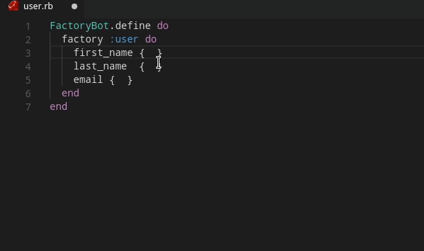

# Faker Snippets

VSCode extension with code snippets for [Faker Gem](https://github.com/stympy/faker)

## Installation (From Store)
1. Go to extensions. ( `ctrl + shift + x`)
2. Search for "Faker Snippets"
3. Click `install`
4. Click `reload`

## Quick Installation
1. Open vscode Quick Open (`ctrl + p`)
2. Paste the code bellow and press enter.
```
ext install giancarlopro.faker-snippets
```
3. Press `reload`

## Usage


## Features

|Index|
|-----|
| [Space](#space) |
| [Subscription](#subscription) |
| [Nation](#nation) |
| [Construction](#construction) |
| [Appliance](#appliance) |
| [Omniauth](#omniauth) |
| [ProgrammingLanguage](#programminglanguage) |
| [String](#string) |
| [Beer](#beer) |
| [Types](#types) |
| [File](#file) |
| [DcComics](#dccomics) |
| [Music](#music) |
| [Number](#number) |
| [Food](#food) |
| [Book](#book) |
| [SlackEmoji](#slackemoji) |
| [Job](#job) |
| [HitchhikersGuideToTheGalaxy](#hitchhikersguidetothegalaxy) |
| [Compass](#compass) |
| [Crypto](#crypto) |
| [Educator](#educator) |
| [Finance](#finance) |
| [Fillmurray](#fillmurray) |
| [Vehicle](#vehicle) |
| [ChileRut](#chilerut) |
| [Stripe](#stripe) |
| [Measurement](#measurement) |
| [Coffee](#coffee) |
| [Artist](#artist) |
| [Coin](#coin) |
| [DrivingLicence](#drivinglicence) |
| [Address](#address) |
| [Gender](#gender) |
| [Hipster](#hipster) |
| [Internet](#internet) |
| [Company](#company) |
| [WorldCup](#worldcup) |
| [Name](#name) |
| [Game](#game) |
| [CryptoCoin](#cryptocoin) |
| [Alphanumeric](#alphanumeric) |
| [Superhero](#superhero) |
| [House](#house) |
| [NatoPhoneticAlphabet](#natophoneticalphabet) |
| [Currency](#currency) |
| [Source](#source) |
| [HarryPotter](#harrypotter) |
| [University](#university) |
| [LoremFlickr](#loremflickr) |
| [FunnyName](#funnyname) |
| [Bank](#bank) |
| [Dessert](#dessert) |
| [PhoneNumber](#phonenumber) |
| [Commerce](#commerce) |
| [Business](#business) |
| [SouthAfrica](#southafrica) |
| [Cannabis](#cannabis) |
| [GreekPhilosophers](#greekphilosophers) |
| [Boolean](#boolean) |
| [Lorem](#lorem) |
| [LoremPixel](#lorempixel) |
| [MichaelScott](#michaelscott) |
| [Movie](#movie) |
| [Time](#time) |
| [ElectricalComponents](#electricalcomponents) |
| [ChuckNorris](#chucknorris) |
| [Avatar](#avatar) |
| [Placeholdit](#placeholdit) |
| [IndustrySegments](#industrysegments) |
| [Code](#code) |
| [Markdown](#markdown) |
| [Quote](#quote) |
| [IDNumber](#idnumber) |
| [NationalHealthService](#nationalhealthservice) |
| [Demographic](#demographic) |
| [Device](#device) |
| [Verb](#verb) |
| [Relationship](#relationship) |
| [Color](#color) |
| [Military](#military) |
| [Esport](#esport) |
| [Marketing](#marketing) |
| [Team](#team) |
| [Invoice](#invoice) |
| [BossaNova](#bossanova) |
| [RuPaul](#rupaul) |
| [Ancient](#ancient) |
| [Science](#science) |
| [Date](#date) |
| [App](#app) |
| [Hacker](#hacker) |
| [RockBand](#rockband) |
| [Twitter](#twitter) |

### Space
|Snippet|Short Snippet|
|-------|-------------|
| Faker::Space.planet | Space.planet |
| Faker::Space.moon | Space.moon |
| Faker::Space.galaxy | Space.galaxy |
| Faker::Space.nebula | Space.nebula |
| Faker::Space.star_cluster | Space.star_cluster |
| Faker::Space.constellation | Space.constellation |
| Faker::Space.star | Space.star |
| Faker::Space.agency | Space.agency |
| Faker::Space.agency_abv | Space.agency_abv |
| Faker::Space.nasa_space_craft | Space.nasa_space_craft |
| Faker::Space.company | Space.company |
| Faker::Space.distance_measurement | Space.distance_measurement |
| Faker::Space.meteorite | Space.meteorite |
| Faker::Space.launch_vehicle | Space.launch_vehicle |
### Subscription
|Snippet|Short Snippet|
|-------|-------------|
| Faker::Subscription.plan | Subscription.plan |
| Faker::Subscription.status | Subscription.status |
| Faker::Subscription.payment_method | Subscription.payment_method |
| Faker::Subscription.subscription_term | Subscription.subscription_term |
| Faker::Subscription.payment_term | Subscription.payment_term |
### Nation
|Snippet|Short Snippet|
|-------|-------------|
| Faker::Nation.nationality | Nation.nationality |
| Faker::Nation.language | Nation.language |
| Faker::Nation.capital_city | Nation.capital_city |
| Faker::Nation.national_sport | Nation.national_sport |
| Faker::Nation.flag | Nation.flag |
### Construction
|Snippet|Short Snippet|
|-------|-------------|
| Faker::Construction.material | Construction.material |
| Faker::Construction.subcontract_category | Construction.subcontract_category |
| Faker::Construction.heavy_equipment | Construction.heavy_equipment |
| Faker::Construction.trade | Construction.trade |
| Faker::Construction.standard_cost_code | Construction.standard_cost_code |
| Faker::Construction.role | Construction.role |
### Appliance
|Snippet|Short Snippet|
|-------|-------------|
| Faker::Appliance.brand | Appliance.brand |
| Faker::Appliance.equipment | Appliance.equipment |
### Omniauth
|Snippet|Short Snippet|
|-------|-------------|
| Faker::Omniauth.google | Omniauth.google |
| Faker::Omniauth.facebook | Omniauth.facebook |
| Faker::Omniauth.twitter | Omniauth.twitter |
| Faker::Omniauth.linkedin | Omniauth.linkedin |
| Faker::Omniauth.github | Omniauth.github |
| Faker::Omniauth.apple | Omniauth.apple |
### ProgrammingLanguage
|Snippet|Short Snippet|
|-------|-------------|
| Faker::ProgrammingLanguage.name | ProgrammingLanguage.name |
| Faker::ProgrammingLanguage.creator | ProgrammingLanguage.creator |
### String
|Snippet|Short Snippet|
|-------|-------------|
| Faker::String.random | String.random |
| Faker::String.random(length: 4) | String.random(length: 4) |
| Faker::String.random(length: 3..12) | String.random(length: 3..12) |
| Faker::String.random(length: [0, 6]) | String.random(length: [0, 6]) |
| Faker::String.random(length: [1, (2..5), [3, 6], nil]) | String.random(length: [1, (2..5), [3, 6], nil]) |
### Beer
|Snippet|Short Snippet|
|-------|-------------|
| Faker::Beer.brand | Beer.brand |
| Faker::Beer.name | Beer.name |
| Faker::Beer.style | Beer.style |
| Faker::Beer.hop | Beer.hop |
| Faker::Beer.yeast | Beer.yeast |
| Faker::Beer.malts | Beer.malts |
| Faker::Beer.ibu | Beer.ibu |
| Faker::Beer.alcohol | Beer.alcohol |
| Faker::Beer.blg | Beer.blg |
### Types
|Snippet|Short Snippet|
|-------|-------------|
| Faker::Types.rb_string | Types.rb_string |
| Faker::Types.character | Types.character |
| Faker::Types.rb_integer | Types.rb_integer |
| Faker::Types.rb_hash | Types.rb_hash |
| Faker::Types.rb_hash(number: 1) | Types.rb_hash(number: 1) |
| Faker::Types.rb_hash(number: 2) | Types.rb_hash(number: 2) |
| Faker::Types.complex_rb_hash | Types.complex_rb_hash |
| Faker::Types.complex_rb_hash(number: 1) | Types.complex_rb_hash(number: 1) |
| Faker::Types.complex_rb_hash(number: 2) | Types.complex_rb_hash(number: 2) |
| Faker::Types.rb_array | Types.rb_array |
| Faker::Types.random_type | Types.random_type |
| Faker::Types.random_complex_type | Types.random_complex_type |
### File
|Snippet|Short Snippet|
|-------|-------------|
| Faker::File.extension | File.extension |
| Faker::File.mime_type | File.mime_type |
| Faker::File.file_name(dir: 'path/to') | File.file_name(dir: 'path/to') |
| Faker::File.file_name(dir: 'foo/bar', name: 'baz') | File.file_name(dir: 'foo/bar', name: 'baz') |
| Faker::File.file_name(dir: 'foo/bar', name: 'baz', ext: 'doc') | File.file_name(dir: 'foo/bar', name: 'baz', ext: 'doc') |
| Faker::File.file_name(dir: 'foo/bar', name: 'baz', ext: 'mp3', directory_separator: '\\\\') | File.file_name(dir: 'foo/bar', name: 'baz', ext: 'mp3', directory_separator: '\\\\') |
| Faker::File.dir | File.dir |
| Faker::File.dir(segment_count: 2) | File.dir(segment_count: 2) |
| Faker::File.dir(segment_count: 3, root: nil, directory_separator: '/') | File.dir(segment_count: 3, root: nil, directory_separator: '/') |
| Faker::File.dir(segment_count: 3, root: nil, directory_separator: '\\\\') | File.dir(segment_count: 3, root: nil, directory_separator: '\\\\') |
### DcComics
|Snippet|Short Snippet|
|-------|-------------|
| Faker::DcComics.hero | DcComics.hero |
| Faker::DcComics.heroine | DcComics.heroine |
| Faker::DcComics.villain | DcComics.villain |
| Faker::DcComics.name | DcComics.name |
| Faker::DcComics.title | DcComics.title |
### Music
|Snippet|Short Snippet|
|-------|-------------|
| Faker::Music.key | Music.key |
| Faker::Music.chord | Music.chord |
| Faker::Music.instrument | Music.instrument |
| Faker::Music.band | Music.band |
| Faker::Music.album | Music.album |
| Faker::Music.genre | Music.genre |
### Number
|Snippet|Short Snippet|
|-------|-------------|
| Faker::Number.number(digits: 10) | Number.number(digits: 10) |
| Faker::Number.leading_zero_number(digits: 10) | Number.leading_zero_number(digits: 10) |
| Faker::Number.decimal_part(digits: 2) | Number.decimal_part(digits: 2) |
| Faker::Number.decimal(l_digits: 2) | Number.decimal(l_digits: 2) |
| Faker::Number.decimal(l_digits: 3, r_digits: 3) | Number.decimal(l_digits: 3, r_digits: 3) |
| Faker::Number.normal(mean: 50, standard_deviation: 3.5) | Number.normal(mean: 50, standard_deviation: 3.5) |
| Faker::Number.hexadecimal(digits: 3) | Number.hexadecimal(digits: 3) |
| Faker::Number.between(from: 1, to: 10) | Number.between(from: 1, to: 10) |
| Faker::Number.within(range: 1..10) | Number.within(range: 1..10) |
| Faker::Number.positive | Number.positive |
| Faker::Number.negative | Number.negative |
| Faker::Number.non_zero_digit | Number.non_zero_digit |
| Faker::Number.digit | Number.digit |
| Faker::Number.between(from: 3, to: 10) | Number.between(from: 3, to: 10) |
### Food
|Snippet|Short Snippet|
|-------|-------------|
| Faker::Food.description | Food.description |
| Faker::Food.dish | Food.dish |
| Faker::Food.fruits | Food.fruits |
| Faker::Food.ingredient | Food.ingredient |
| Faker::Food.measurement | Food.measurement |
| Faker::Food.metric_measurement | Food.metric_measurement |
| Faker::Food.spice | Food.spice |
| Faker::Food.sushi | Food.sushi |
| Faker::Food.vegetables | Food.vegetables |
### Book
|Snippet|Short Snippet|
|-------|-------------|
| Faker::Book.title | Book.title |
| Faker::Book.author | Book.author |
| Faker::Book.publisher | Book.publisher |
| Faker::Book.genre | Book.genre |
### SlackEmoji
|Snippet|Short Snippet|
|-------|-------------|
| Faker::SlackEmoji.people | SlackEmoji.people |
| Faker::SlackEmoji.nature | SlackEmoji.nature |
| Faker::SlackEmoji.food_and_drink | SlackEmoji.food_and_drink |
| Faker::SlackEmoji.celebration | SlackEmoji.celebration |
| Faker::SlackEmoji.activity | SlackEmoji.activity |
| Faker::SlackEmoji.travel_and_places | SlackEmoji.travel_and_places |
| Faker::SlackEmoji.objects_and_symbols | SlackEmoji.objects_and_symbols |
| Faker::SlackEmoji.custom | SlackEmoji.custom |
| Faker::SlackEmoji.emoji | SlackEmoji.emoji |
### Job
|Snippet|Short Snippet|
|-------|-------------|
| Faker::Job.title | Job.title |
| Faker::Job.field | Job.field |
| Faker::Job.seniority | Job.seniority |
| Faker::Job.position | Job.position |
| Faker::Job.key_skill | Job.key_skill |
| Faker::Job.employment_type | Job.employment_type |
| Faker::Job.education_level | Job.education_level |
### HitchhikersGuideToTheGalaxy
|Snippet|Short Snippet|
|-------|-------------|
| Faker::HitchhikersGuideToTheGalaxy.character | HitchhikersGuideToTheGalaxy.character |
| Faker::HitchhikersGuideToTheGalaxy.location | HitchhikersGuideToTheGalaxy.location |
| Faker::HitchhikersGuideToTheGalaxy.marvin_quote | HitchhikersGuideToTheGalaxy.marvin_quote |
| Faker::HitchhikersGuideToTheGalaxy.planet | HitchhikersGuideToTheGalaxy.planet |
| Faker::HitchhikersGuideToTheGalaxy.quote | HitchhikersGuideToTheGalaxy.quote |
| Faker::HitchhikersGuideToTheGalaxy.specie | HitchhikersGuideToTheGalaxy.specie |
| Faker::HitchhikersGuideToTheGalaxy.starship | HitchhikersGuideToTheGalaxy.starship |
### Compass
|Snippet|Short Snippet|
|-------|-------------|
| Faker::Compass.quarter_wind_abbreviation | Compass.quarter_wind_abbreviation |
### Crypto
|Snippet|Short Snippet|
|-------|-------------|
| Faker::Crypto.md5 | Crypto.md5 |
| Faker::Crypto.sha1 | Crypto.sha1 |
| Faker::Crypto.sha256 | Crypto.sha256 |
### Educator
|Snippet|Short Snippet|
|-------|-------------|
| Faker::Educator.university | Educator.university |
| Faker::Educator.secondary_school | Educator.secondary_school |
| Faker::Educator.degree | Educator.degree |
| Faker::Educator.course_name | Educator.course_name |
| Faker::Educator.subject | Educator.subject |
| Faker::Educator.campus | Educator.campus |
### Finance
|Snippet|Short Snippet|
|-------|-------------|
| Faker::Finance.credit_card | Finance.credit_card |
| Faker::Finance.credit_card(:mastercard) | Finance.credit_card(:mastercard) |
| Faker::Finance.credit_card(:mastercard, :visa) | Finance.credit_card(:mastercard, :visa) |
| Faker::Finance.vat_number | Finance.vat_number |
| Faker::Finance.vat_number(country: 'DE') | Finance.vat_number(country: 'DE') |
| Faker::Finance.vat_number(country: 'ZA') | Finance.vat_number(country: 'ZA') |
### Fillmurray
|Snippet|Short Snippet|
|-------|-------------|
| Faker::Fillmurray.image | Fillmurray.image |
| Faker::Fillmurray.image(grayscale: true) | Fillmurray.image(grayscale: true) |
| Faker::Fillmurray.image(grayscale: false, width: 200, height: 400) | Fillmurray.image(grayscale: false, width: 200, height: 400) |
### Vehicle
|Snippet|Short Snippet|
|-------|-------------|
| Faker::Vehicle.vin | Vehicle.vin |
| Faker::Vehicle.manufacture | Vehicle.manufacture |
| Faker::Vehicle.make | Vehicle.make |
| Faker::Vehicle.model | Vehicle.model |
| Faker::Vehicle.model(make_of_model: 'Toyota') | Vehicle.model(make_of_model: 'Toyota') |
| Faker::Vehicle.make_and_model | Vehicle.make_and_model |
| Faker::Vehicle.color | Vehicle.color |
| Faker::Vehicle.transmission | Vehicle.transmission |
| Faker::Vehicle.drive_type | Vehicle.drive_type |
| Faker::Vehicle.fuel_type | Vehicle.fuel_type |
| Faker::Vehicle.style | Vehicle.style |
| Faker::Vehicle.car_type | Vehicle.car_type |
| Faker::Vehicle.car_options | Vehicle.car_options |
| Faker::Vehicle.standard_specs | Vehicle.standard_specs |
| Faker::Vehicle.doors | Vehicle.doors |
| Faker::Vehicle.door_count | Vehicle.door_count |
| Faker::Vehicle.engine_size | Vehicle.engine_size |
| Faker::Vehicle.engine | Vehicle.engine |
| Faker::Vehicle.year | Vehicle.year |
| Faker::Vehicle.mileage | Vehicle.mileage |
| Faker::Vehicle.mileage(min: 50_000) | Vehicle.mileage(min: 50_000) |
| Faker::Vehicle.mileage(min: 50_000, max: 250_000) | Vehicle.mileage(min: 50_000, max: 250_000) |
| Faker::Vehicle.kilometrage | Vehicle.kilometrage |
| Faker::Vehicle.license_plate | Vehicle.license_plate |
| Faker::Vehicle.license_plate(state_abreviation: 'FL') | Vehicle.license_plate(state_abreviation: 'FL') |
| Faker::Vehicle.singapore_license_plate | Vehicle.singapore_license_plate |
### ChileRut
|Snippet|Short Snippet|
|-------|-------------|
| Faker::ChileRut.full_rut | ChileRut.full_rut |
| Faker::ChileRut.rut | ChileRut.rut |
| Faker::ChileRut.rut(min_rut: 20_890_156) | ChileRut.rut(min_rut: 20_890_156) |
| Faker::ChileRut.rut | ChileRut.rut |
| Faker::ChileRut.last_rut | ChileRut.last_rut |
| Faker::ChileRut.dv | ChileRut.dv |
| Faker::ChileRut.rut | ChileRut.rut |
| Faker::ChileRut.check_digit | ChileRut.check_digit |
### Stripe
|Snippet|Short Snippet|
|-------|-------------|
| Faker::Stripe.valid_card | Stripe.valid_card |
| Faker::Stripe.valid_card(card_type: \"visa_debit\") | Stripe.valid_card(card_type: \"visa_debit\") |
| Faker::Stripe.valid_token | Stripe.valid_token |
| Faker::Stripe.valid_token(card_type: \"mc_debit\") | Stripe.valid_token(card_type: \"mc_debit\") |
| Faker::Stripe.invalid_card | Stripe.invalid_card |
| Faker::Stripe.invalid_card(card_error: \"addressZipFail\") | Stripe.invalid_card(card_error: \"addressZipFail\") |
| Faker::Stripe.month | Stripe.month |
| Faker::Stripe.year | Stripe.year |
| Faker::Stripe.ccv | Stripe.ccv |
| Faker::Stripe.ccv(card_type: \"amex\") | Stripe.ccv(card_type: \"amex\") |
### Measurement
|Snippet|Short Snippet|
|-------|-------------|
| Faker::Measurement.height | Measurement.height |
| Faker::Measurement.height(amount: 1.4) | Measurement.height(amount: 1.4) |
| Faker::Measurement.height(amount: \"none\") | Measurement.height(amount: \"none\") |
| Faker::Measurement.height(amount: \"all\") | Measurement.height(amount: \"all\") |
| Faker::Measurement.length | Measurement.length |
| Faker::Measurement.volume | Measurement.volume |
| Faker::Measurement.weight | Measurement.weight |
| Faker::Measurement.metric_height | Measurement.metric_height |
| Faker::Measurement.metric_length | Measurement.metric_length |
| Faker::Measurement.metric_volume | Measurement.metric_volume |
| Faker::Measurement.metric_weight | Measurement.metric_weight |
### Coffee
|Snippet|Short Snippet|
|-------|-------------|
| Faker::Coffee.blend_name | Coffee.blend_name |
| Faker::Coffee.origin | Coffee.origin |
| Faker::Coffee.variety | Coffee.variety |
| Faker::Coffee.notes | Coffee.notes |
| Faker::Coffee.intensifier | Coffee.intensifier |
### Artist
|Snippet|Short Snippet|
|-------|-------------|
| Faker::Artist.name | Artist.name |
### Coin
|Snippet|Short Snippet|
|-------|-------------|
| Faker::Coin.flip | Coin.flip |
| Faker::Coin.name | Coin.name |
### DrivingLicence
|Snippet|Short Snippet|
|-------|-------------|
| Faker::DrivingLicence.northern_irish_driving_licence | DrivingLicence.northern_irish_driving_licence |
### Address
|Snippet|Short Snippet|
|-------|-------------|
| Faker::Address.city | Address.city |
| Faker::Address.street_name | Address.street_name |
| Faker::Address.street_address | Address.street_address |
| Faker::Address.secondary_address | Address.secondary_address |
| Faker::Address.building_number | Address.building_number |
| Faker::Address.community | Address.community |
| Faker::Address.zip_code | Address.zip_code |
| Faker::Address.zip | Address.zip |
| Faker::Address.postcode | Address.postcode |
| Faker::Address.time_zone | Address.time_zone |
| Faker::Address.street_suffix | Address.street_suffix |
| Faker::Address.city_suffix | Address.city_suffix |
| Faker::Address.city_prefix | Address.city_prefix |
| Faker::Address.state | Address.state |
| Faker::Address.state_abbr | Address.state_abbr |
| Faker::Address.country | Address.country |
| Faker::Address.country_by_code(code: 'NL') | Address.country_by_code(code: 'NL') |
| Faker::Address.country_name_to_code(name: 'united_states') | Address.country_name_to_code(name: 'united_states') |
| Faker::Address.country_code | Address.country_code |
| Faker::Address.country_code_long | Address.country_code_long |
| Faker::Address.latitude | Address.latitude |
| Faker::Address.longitude | Address.longitude |
| Faker::Address.full_address | Address.full_address |
### Gender
|Snippet|Short Snippet|
|-------|-------------|
| Faker::Gender.type | Gender.type |
| Faker::Gender.binary_type | Gender.binary_type |
### Hipster
|Snippet|Short Snippet|
|-------|-------------|
| Faker::Hipster.word | Hipster.word |
| Faker::Hipster.words | Hipster.words |
| Faker::Hipster.words(number: 4) | Hipster.words(number: 4) |
| Faker::Hipster.words(number: 4, supplemental: true) | Hipster.words(number: 4, supplemental: true) |
| Faker::Hipster.words(number: 4, supplemental: true, spaces_allowed: true) | Hipster.words(number: 4, supplemental: true, spaces_allowed: true) |
| Faker::Hipster.sentence | Hipster.sentence |
| Faker::Hipster.sentence(word_count: 3) | Hipster.sentence(word_count: 3) |
| Faker::Hipster.sentence(word_count: 3, supplemental: true) | Hipster.sentence(word_count: 3, supplemental: true) |
| Faker::Hipster.sentence(word_count: 3, supplemental: false, random_words_to_add: 4) | Hipster.sentence(word_count: 3, supplemental: false, random_words_to_add: 4) |
| Faker::Hipster.sentence(word_count: 3, supplemental: true, random_words_to_add: 4) | Hipster.sentence(word_count: 3, supplemental: true, random_words_to_add: 4) |
| Faker::Hipster.sentences | Hipster.sentences |
| Faker::Hipster.sentences(number: 1) | Hipster.sentences(number: 1) |
| Faker::Hipster.sentences(number: 1, supplemental: true) | Hipster.sentences(number: 1, supplemental: true) |
| Faker::Hipster.paragraph | Hipster.paragraph |
| Faker::Hipster.paragraph(sentence_count: 2) | Hipster.paragraph(sentence_count: 2) |
| Faker::Hipster.paragraph(sentence_count: 2, supplemental: true) | Hipster.paragraph(sentence_count: 2, supplemental: true) |
| Faker::Hipster.paragraph(sentence_count: 2, supplemental: false, random_sentences_to_add: 4) | Hipster.paragraph(sentence_count: 2, supplemental: false, random_sentences_to_add: 4) |
| Faker::Hipster.paragraph(sentence_count: 2, supplemental: true, random_sentences_to_add: 4) | Hipster.paragraph(sentence_count: 2, supplemental: true, random_sentences_to_add: 4) |
| Faker::Hipster.paragraphs | Hipster.paragraphs |
| Faker::Hipster.paragraphs(number: 1) | Hipster.paragraphs(number: 1) |
| Faker::Hipster.paragraphs(number: 1, supplemental: true) | Hipster.paragraphs(number: 1, supplemental: true) |
| Faker::Hipster.paragraph_by_chars | Hipster.paragraph_by_chars |
| Faker::Hipster.paragraph_by_chars(characters: 256, supplemental: false) | Hipster.paragraph_by_chars(characters: 256, supplemental: false) |
### Internet
|Snippet|Short Snippet|
|-------|-------------|
| Faker::Internet.free_email | Internet.free_email |
| Faker::Internet.email | Internet.email |
| Faker::Internet.email(name: 'Nancy') | Internet.email(name: 'Nancy') |
| Faker::Internet.email(name: 'Janelle Santiago', separators: '+') | Internet.email(name: 'Janelle Santiago', separators: '+') |
| Faker::Internet.free_email | Internet.free_email |
| Faker::Internet.free_email(name: 'Nancy') | Internet.free_email(name: 'Nancy') |
| Faker::Internet.safe_email | Internet.safe_email |
| Faker::Internet.safe_email(name: 'Nancy') | Internet.safe_email(name: 'Nancy') |
| Faker::Internet.username | Internet.username |
| Faker::Internet.username(specifier: 'Nancy') | Internet.username(specifier: 'Nancy') |
| Faker::Internet.username(specifier: 'Nancy Johnson', separators: %w(. _ -)) | Internet.username(specifier: 'Nancy Johnson', separators: %w(. _ -)) |
| Faker::Internet.password | Internet.password |
| Faker::Internet.password(min_length: 8) | Internet.password(min_length: 8) |
| Faker::Internet.password(min_length: 10, max_length: 20) | Internet.password(min_length: 10, max_length: 20) |
| Faker::Internet.password(min_length: 10, max_length: 20, mix_case: true) | Internet.password(min_length: 10, max_length: 20, mix_case: true) |
| Faker::Internet.password(min_length: 10, max_length: 20, mix_case: true, special_characters: true) | Internet.password(min_length: 10, max_length: 20, mix_case: true, special_characters: true) |
| Faker::Internet.domain_name | Internet.domain_name |
| Faker::Internet.domain_word | Internet.domain_word |
| Faker::Internet.domain_suffix | Internet.domain_suffix |
| Faker::Internet.ip_v4_address | Internet.ip_v4_address |
| Faker::Internet.private_ip_v4_address | Internet.private_ip_v4_address |
| Faker::Internet.public_ip_v4_address | Internet.public_ip_v4_address |
| Faker::Internet.ip_v4_cidr | Internet.ip_v4_cidr |
| Faker::Internet.ip_v6_address | Internet.ip_v6_address |
| Faker::Internet.ip_v6_cidr | Internet.ip_v6_cidr |
| Faker::Internet.mac_address | Internet.mac_address |
| Faker::Internet.mac_address(prefix: '55:44:33') | Internet.mac_address(prefix: '55:44:33') |
| Faker::Internet.url | Internet.url |
| Faker::Internet.url(host: 'example.com') | Internet.url(host: 'example.com') |
| Faker::Internet.url(host: 'example.com', path: '/foobar.html') | Internet.url(host: 'example.com', path: '/foobar.html') |
| Faker::Internet.slug | Internet.slug |
| Faker::Internet.slug(words: 'foo bar') | Internet.slug(words: 'foo bar') |
| Faker::Internet.slug(words: 'foo bar', glue: '-') | Internet.slug(words: 'foo bar', glue: '-') |
| Faker::Internet.user_agent | Internet.user_agent |
| Faker::Internet.user_agent(vendor: :firefox) | Internet.user_agent(vendor: :firefox) |
| Faker::Internet.uuid | Internet.uuid |
### Company
|Snippet|Short Snippet|
|-------|-------------|
| Faker::Company.name | Company.name |
| Faker::Company.suffix | Company.suffix |
| Faker::Company.industry | Company.industry |
| Faker::Company.catch_phrase | Company.catch_phrase |
| Faker::Company.buzzword | Company.buzzword |
| Faker::Company.bs | Company.bs |
| Faker::Company.ein | Company.ein |
| Faker::Company.duns_number | Company.duns_number |
| Faker::Company.logo | Company.logo |
| Faker::Company.type | Company.type |
| Faker::Company.profession | Company.profession |
| Faker::Company.swedish_organisation_number | Company.swedish_organisation_number |
| Faker::Company.czech_organisation_number | Company.czech_organisation_number |
| Faker::Company.french_siren_number | Company.french_siren_number |
| Faker::Company.french_siret_number | Company.french_siret_number |
| Faker::Company.norwegian_organisation_number | Company.norwegian_organisation_number |
| Faker::Company.australian_business_number | Company.australian_business_number |
| Faker::Company.spanish_organisation_number | Company.spanish_organisation_number |
| Faker::Company.polish_taxpayer_identification_number | Company.polish_taxpayer_identification_number |
| Faker::Company.polish_register_of_national_economy | Company.polish_register_of_national_economy |
| Faker::Company.south_african_pty_ltd_registration_number | Company.south_african_pty_ltd_registration_number |
| Faker::Company.south_african_close_corporation_registration_number | Company.south_african_close_corporation_registration_number |
| Faker::Company.south_african_listed_company_registration_number | Company.south_african_listed_company_registration_number |
| Faker::Company.south_african_trust_registration_number | Company.south_african_trust_registration_number |
| Faker::Company.brazilian_company_number | Company.brazilian_company_number |
| Faker::Company.brazilian_company_number(formatted: true) | Company.brazilian_company_number(formatted: true) |
| Faker::Company.sic_code | Company.sic_code |
### WorldCup
|Snippet|Short Snippet|
|-------|-------------|
| Faker::WorldCup.team | WorldCup.team |
| Faker::WorldCup.stadium | WorldCup.stadium |
| Faker::WorldCup.city | WorldCup.city |
| Faker::WorldCup.group | WorldCup.group |
| Faker::WorldCup.group(group: 'group_A') | WorldCup.group(group: 'group_A') |
| Faker::WorldCup.roster | WorldCup.roster |
| Faker::WorldCup.roster(country: 'Russia', type: 'coach') | WorldCup.roster(country: 'Russia', type: 'coach') |
### Name
|Snippet|Short Snippet|
|-------|-------------|
| Faker::Name.name_with_middle | Name.name_with_middle |
| Faker::Name.female_first_name | Name.female_first_name |
| Faker::Name.initials(number: 2) | Name.initials(number: 2) |
### Game
|Snippet|Short Snippet|
|-------|-------------|
| Faker::Game.title | Game.title |
| Faker::Game.genre | Game.genre |
| Faker::Game.platform | Game.platform |
### CryptoCoin
|Snippet|Short Snippet|
|-------|-------------|
| Faker::CryptoCoin.coin_name | CryptoCoin.coin_name |
| Faker::CryptoCoin.acronym | CryptoCoin.acronym |
| Faker::CryptoCoin.url_logo | CryptoCoin.url_logo |
| Faker::CryptoCoin.coin_array | CryptoCoin.coin_array |
### Alphanumeric
|Snippet|Short Snippet|
|-------|-------------|
| Faker::Alphanumeric.alpha(number: 10) | Alphanumeric.alpha(number: 10) |
| Faker::Alphanumeric.alphanumeric(number: 10) | Alphanumeric.alphanumeric(number: 10) |
| Faker::Alphanumeric.alphanumeric(number: 10, min_alpha: 3) | Alphanumeric.alphanumeric(number: 10, min_alpha: 3) |
| Faker::Alphanumeric.alphanumeric(number: 10, min_alpha: 3, min_numeric: 3) | Alphanumeric.alphanumeric(number: 10, min_alpha: 3, min_numeric: 3) |
### Superhero
|Snippet|Short Snippet|
|-------|-------------|
| Faker::Superhero.name | Superhero.name |
| Faker::Superhero.power | Superhero.power |
| Faker::Superhero.prefix | Superhero.prefix |
| Faker::Superhero.suffix | Superhero.suffix |
| Faker::Superhero.descriptor | Superhero.descriptor |
### House
|Snippet|Short Snippet|
|-------|-------------|
| Faker::House.furniture | House.furniture |
| Faker::House.room | House.room |
### NatoPhoneticAlphabet
|Snippet|Short Snippet|
|-------|-------------|
| Faker::NatoPhoneticAlphabet.code_word | NatoPhoneticAlphabet.code_word |
### Currency
|Snippet|Short Snippet|
|-------|-------------|
| Faker::Currency.name | Currency.name |
| Faker::Currency.code | Currency.code |
| Faker::Currency.symbol | Currency.symbol |
### Source
|Snippet|Short Snippet|
|-------|-------------|
| Faker::Source.hello_world | Source.hello_world |
| Faker::Source.hello_world(lang: :javascript) | Source.hello_world(lang: :javascript) |
| Faker::Source.print | Source.print |
| Faker::Source.print(str: 'cake') | Source.print(str: 'cake') |
| Faker::Source.print(str: 'cake', lang: :javascript) | Source.print(str: 'cake', lang: :javascript) |
### HarryPotter
|Snippet|Short Snippet|
|-------|-------------|
| Faker::HarryPotter.character | HarryPotter.character |
| Faker::HarryPotter.location | HarryPotter.location |
| Faker::HarryPotter.quote | HarryPotter.quote |
| Faker::HarryPotter.book | HarryPotter.book |
| Faker::HarryPotter.house | HarryPotter.house |
| Faker::HarryPotter.spell | HarryPotter.spell |
### University
|Snippet|Short Snippet|
|-------|-------------|
| Faker::University.name | University.name |
| Faker::University.prefix | University.prefix |
| Faker::University.suffix | University.suffix |
| Faker::University.greek_organization | University.greek_organization |
| Faker::University.greek_alphabet | University.greek_alphabet |
### LoremFlickr
|Snippet|Short Snippet|
|-------|-------------|
| Faker::LoremFlickr.image | LoremFlickr.image |
| Faker::LoremFlickr.image(size: \"50x60\") | LoremFlickr.image(size: \"50x60\") |
| Faker::LoremFlickr.image(size: \"50x60\", search_terms: ['sports']) | LoremFlickr.image(size: \"50x60\", search_terms: ['sports']) |
| Faker::LoremFlickr.image(size: \"50x60\", search_terms: ['sports', 'fitness']) | LoremFlickr.image(size: \"50x60\", search_terms: ['sports', 'fitness']) |
| Faker::LoremFlickr.image(size: \"50x60\", search_terms: ['sports', 'fitness'], match_all: true) | LoremFlickr.image(size: \"50x60\", search_terms: ['sports', 'fitness'], match_all: true) |
| Faker::LoremFlickr.grayscale_image | LoremFlickr.grayscale_image |
| Faker::LoremFlickr.grayscale_image(size: \"50x60\") | LoremFlickr.grayscale_image(size: \"50x60\") |
| Faker::LoremFlickr.grayscale_image(size: \"50x60\", search_terms: ['sports']) | LoremFlickr.grayscale_image(size: \"50x60\", search_terms: ['sports']) |
| Faker::LoremFlickr.grayscale_image(size: \"50x60\", search_terms: ['sports', 'fitness']) | LoremFlickr.grayscale_image(size: \"50x60\", search_terms: ['sports', 'fitness']) |
| Faker::LoremFlickr.grayscale_image(size: \"50x60\", search_terms: ['sports', 'fitness'], match_all: true) | LoremFlickr.grayscale_image(size: \"50x60\", search_terms: ['sports', 'fitness'], match_all: true) |
| Faker::LoremFlickr.pixelated_image | LoremFlickr.pixelated_image |
| Faker::LoremFlickr.pixelated_image(size: \"50x60\") | LoremFlickr.pixelated_image(size: \"50x60\") |
| Faker::LoremFlickr.pixelated_image(size: \"50x60\", search_terms: ['sports']) | LoremFlickr.pixelated_image(size: \"50x60\", search_terms: ['sports']) |
| Faker::LoremFlickr.pixelated_image(size: \"50x60\", search_terms: ['sports', 'fitness']) | LoremFlickr.pixelated_image(size: \"50x60\", search_terms: ['sports', 'fitness']) |
| Faker::LoremFlickr.pixelated_image(size: \"50x60\", search_terms: ['sports', 'fitness'], match_all: true) | LoremFlickr.pixelated_image(size: \"50x60\", search_terms: ['sports', 'fitness'], match_all: true) |
| Faker::LoremFlickr.colorized_image | LoremFlickr.colorized_image |
| Faker::LoremFlickr.colorized_image(size: \"50x60\") | LoremFlickr.colorized_image(size: \"50x60\") |
| Faker::LoremFlickr.colorized_image(size: \"50x60\", color: 'red') | LoremFlickr.colorized_image(size: \"50x60\", color: 'red') |
| Faker::LoremFlickr.colorized_image(size: \"50x60\", color: 'red', search_terms: ['sports']) | LoremFlickr.colorized_image(size: \"50x60\", color: 'red', search_terms: ['sports']) |
| Faker::LoremFlickr.colorized_image(size: \"50x60\", color: 'red', search_terms: ['sports', 'fitness']) | LoremFlickr.colorized_image(size: \"50x60\", color: 'red', search_terms: ['sports', 'fitness']) |
| Faker::LoremFlickr.colorized_image(size: \"50x60\", color: 'red', search_terms: ['sports', 'fitness'], match_all: true) | LoremFlickr.colorized_image(size: \"50x60\", color: 'red', search_terms: ['sports', 'fitness'], match_all: true) |
### FunnyName
|Snippet|Short Snippet|
|-------|-------------|
| Faker::FunnyName.name | FunnyName.name |
| Faker::FunnyName.two_word_name | FunnyName.two_word_name |
| Faker::FunnyName.three_word_name | FunnyName.three_word_name |
| Faker::FunnyName.four_word_name | FunnyName.four_word_name |
| Faker::FunnyName.name_with_initial | FunnyName.name_with_initial |
### Bank
|Snippet|Short Snippet|
|-------|-------------|
| Faker::Bank.account_number | Bank.account_number |
| Faker::Bank.account_number(digits: 13) | Bank.account_number(digits: 13) |
| Faker::Bank.iban | Bank.iban |
| Faker::Bank.iban(country_code: \"be\") | Bank.iban(country_code: \"be\") |
| Faker::Bank.name | Bank.name |
| Faker::Bank.routing_number | Bank.routing_number |
| Faker::Bank.swift_bic | Bank.swift_bic |
### Dessert
|Snippet|Short Snippet|
|-------|-------------|
| Faker::Dessert.variety | Dessert.variety |
| Faker::Dessert.topping | Dessert.topping |
| Faker::Dessert.flavor | Dessert.flavor |
### PhoneNumber
|Snippet|Short Snippet|
|-------|-------------|
| Faker::PhoneNumber.phone_number | PhoneNumber.phone_number |
| Faker::PhoneNumber.cell_phone | PhoneNumber.cell_phone |
| Faker::PhoneNumber.area_code | PhoneNumber.area_code |
| Faker::PhoneNumber.exchange_code | PhoneNumber.exchange_code |
| Faker::PhoneNumber.subscriber_number | PhoneNumber.subscriber_number |
| Faker::PhoneNumber.subscriber_number(length: 2) | PhoneNumber.subscriber_number(length: 2) |
| Faker::PhoneNumber.extension | PhoneNumber.extension |
| Faker::PhoneNumber.country_code | PhoneNumber.country_code |
| Faker::PhoneNumber.phone_number_with_country_code | PhoneNumber.phone_number_with_country_code |
| Faker::PhoneNumber.cell_phone_with_country_code | PhoneNumber.cell_phone_with_country_code |
### Commerce
|Snippet|Short Snippet|
|-------|-------------|
| Faker::Commerce.color | Commerce.color |
| Faker::Commerce.department | Commerce.department |
| Faker::Commerce.department(max: 5) | Commerce.department(max: 5) |
| Faker::Commerce.department(max: 2, fixed_amount: true) | Commerce.department(max: 2, fixed_amount: true) |
| Faker::Commerce.material | Commerce.material |
| Faker::Commerce.product_name | Commerce.product_name |
| Faker::Commerce.price | Commerce.price |
| Faker::Commerce.price(range: 0..10.0, as_string: true) | Commerce.price(range: 0..10.0, as_string: true) |
| Faker::Commerce.promotion_code | Commerce.promotion_code |
| Faker::Commerce.promotion_code(digits: 2) | Commerce.promotion_code(digits: 2) |
| Faker::Commerce.material | Commerce.material |
### Business
|Snippet|Short Snippet|
|-------|-------------|
| Faker::Business.credit_card_number | Business.credit_card_number |
| Faker::Business.credit_card_expiry_date | Business.credit_card_expiry_date |
| Faker::Business.credit_card_type | Business.credit_card_type |
### SouthAfrica
|Snippet|Short Snippet|
|-------|-------------|
| Faker::SouthAfrica.id_number | SouthAfrica.id_number |
| Faker::SouthAfrica.valid_id_number | SouthAfrica.valid_id_number |
| Faker::SouthAfrica.invalid_id_number | SouthAfrica.invalid_id_number |
| Faker::SouthAfrica.phone_number | SouthAfrica.phone_number |
| Faker::SouthAfrica.cell_phone | SouthAfrica.cell_phone |
| Faker::SouthAfrica.pty_ltd_registration_number | SouthAfrica.pty_ltd_registration_number |
| Faker::SouthAfrica.close_corporation_registration_number | SouthAfrica.close_corporation_registration_number |
| Faker::SouthAfrica.listed_company_registration_number | SouthAfrica.listed_company_registration_number |
| Faker::SouthAfrica.trust_registration_number | SouthAfrica.trust_registration_number |
| Faker::SouthAfrica.vat_number | SouthAfrica.vat_number |
### Cannabis
|Snippet|Short Snippet|
|-------|-------------|
| Faker::Cannabis.strain | Cannabis.strain |
| Faker::Cannabis.cannabinoid_abbreviation | Cannabis.cannabinoid_abbreviation |
| Faker::Cannabis.cannabinoid | Cannabis.cannabinoid |
| Faker::Cannabis.terpene | Cannabis.terpene |
| Faker::Cannabis.medical_use | Cannabis.medical_use |
| Faker::Cannabis.health_benefit | Cannabis.health_benefit |
| Faker::Cannabis.category | Cannabis.category |
| Faker::Cannabis.type | Cannabis.type |
| Faker::Cannabis.buzzword | Cannabis.buzzword |
| Faker::Cannabis.brand | Cannabis.brand |
### GreekPhilosophers
|Snippet|Short Snippet|
|-------|-------------|
| Faker::GreekPhilosophers.name | GreekPhilosophers.name |
| Faker::GreekPhilosophers.quote | GreekPhilosophers.quote |
### Boolean
|Snippet|Short Snippet|
|-------|-------------|
| Faker::Boolean.boolean | Boolean.boolean |
| Faker::Boolean.boolean(true_ratio: 0.2) | Boolean.boolean(true_ratio: 0.2) |
### Lorem
|Snippet|Short Snippet|
|-------|-------------|
| Faker::Lorem.word | Lorem.word |
| Faker::Lorem.words | Lorem.words |
| Faker::Lorem.words(number: 4) | Lorem.words(number: 4) |
| Faker::Lorem.words(number: 4, supplemental: true) | Lorem.words(number: 4, supplemental: true) |
| Faker::Lorem.multibyte | Lorem.multibyte |
| Faker::Lorem.characters | Lorem.characters |
| Faker::Lorem.characters(number: 10) | Lorem.characters(number: 10) |
| Faker::Lorem.characters(number: 10, min_alpha: 4) | Lorem.characters(number: 10, min_alpha: 4) |
| Faker::Lorem.characters(number: 10, min_alpha: 4, min_numeric: 1) | Lorem.characters(number: 10, min_alpha: 4, min_numeric: 1) |
| Faker::Lorem.sentence | Lorem.sentence |
| Faker::Lorem.sentence(word_count: 3) | Lorem.sentence(word_count: 3) |
| Faker::Lorem.sentence(word_count: 3, supplemental: true) | Lorem.sentence(word_count: 3, supplemental: true) |
| Faker::Lorem.sentence(word_count: 3, supplemental: false, random_words_to_add: 4) | Lorem.sentence(word_count: 3, supplemental: false, random_words_to_add: 4) |
| Faker::Lorem.sentence(word_count: 3, supplemental: true, random_words_to_add: 4) | Lorem.sentence(word_count: 3, supplemental: true, random_words_to_add: 4) |
| Faker::Lorem.sentences | Lorem.sentences |
| Faker::Lorem.sentences(number: 1) | Lorem.sentences(number: 1) |
| Faker::Lorem.sentences(number: 1, supplemental: true) | Lorem.sentences(number: 1, supplemental: true) |
| Faker::Lorem.paragraph | Lorem.paragraph |
| Faker::Lorem.paragraph(sentence_count: 2) | Lorem.paragraph(sentence_count: 2) |
| Faker::Lorem.paragraph(sentence_count: 2, supplemental: true) | Lorem.paragraph(sentence_count: 2, supplemental: true) |
| Faker::Lorem.paragraph(sentence_count: 2, supplemental: false, random_sentences_to_add: 4) | Lorem.paragraph(sentence_count: 2, supplemental: false, random_sentences_to_add: 4) |
| Faker::Lorem.paragraph(sentence_count: 2, supplemental: true, random_sentences_to_add: 4) | Lorem.paragraph(sentence_count: 2, supplemental: true, random_sentences_to_add: 4) |
| Faker::Lorem.paragraphs | Lorem.paragraphs |
| Faker::Lorem.paragraphs(number: 1) | Lorem.paragraphs(number: 1) |
| Faker::Lorem.paragraphs(number: 1, supplemental: true) | Lorem.paragraphs(number: 1, supplemental: true) |
| Faker::Lorem.question | Lorem.question |
| Faker::Lorem.question(word_count: 4) | Lorem.question(word_count: 4) |
| Faker::Lorem.question(word_count: 4, supplemental: false) | Lorem.question(word_count: 4, supplemental: false) |
| Faker::Lorem.question(word_count: 4, supplemental: false, random_words_to_add: 0) | Lorem.question(word_count: 4, supplemental: false, random_words_to_add: 0) |
| Faker::Lorem.questions(number: 3) | Lorem.questions(number: 3) |
| Faker::Lorem.questions(number: 3, supplemental: false) | Lorem.questions(number: 3, supplemental: false) |
| Faker::Lorem.paragraph_by_chars | Lorem.paragraph_by_chars |
| Faker::Lorem.paragraph_by_chars(number: 256, supplemental: false) | Lorem.paragraph_by_chars(number: 256, supplemental: false) |
### LoremPixel
|Snippet|Short Snippet|
|-------|-------------|
| Faker::LoremPixel.image | LoremPixel.image |
| Faker::LoremPixel.image(size: \"50x60\") | LoremPixel.image(size: \"50x60\") |
| Faker::LoremPixel.image(size: \"50x60\", is_gray: true) | LoremPixel.image(size: \"50x60\", is_gray: true) |
| Faker::LoremPixel.image(size: \"50x60\", is_gray: false, category: 'sports') | LoremPixel.image(size: \"50x60\", is_gray: false, category: 'sports') |
| Faker::LoremPixel.image(size: \"50x60\", is_gray: false, category: 'sports', number: 3) | LoremPixel.image(size: \"50x60\", is_gray: false, category: 'sports', number: 3) |
| Faker::LoremPixel.image(size: \"50x60\", is_gray: false, category: 'sports', number: 3, text: 'Dummy-text') | LoremPixel.image(size: \"50x60\", is_gray: false, category: 'sports', number: 3, text: 'Dummy-text') |
| Faker::LoremPixel.image(size: \"50x60\", is_gray: false, category: 'sports', number: nil, text: 'Dummy-text') | LoremPixel.image(size: \"50x60\", is_gray: false, category: 'sports', number: nil, text: 'Dummy-text') |
| Faker::LoremPixel.image(secure: false) | LoremPixel.image(secure: false) |
### MichaelScott
|Snippet|Short Snippet|
|-------|-------------|
| Faker::MichaelScott.quote | MichaelScott.quote |
### Movie
|Snippet|Short Snippet|
|-------|-------------|
| Faker::Movie.quote | Movie.quote |
### Time
|Snippet|Short Snippet|
|-------|-------------|
| Faker::Time.between(from: DateTime.now - 1, to: DateTime.now) | Time.between(from: DateTime.now - 1, to: DateTime.now) |
| Faker::Time.between(from: DateTime.now - 1, to: DateTime.now, format: :default) | Time.between(from: DateTime.now - 1, to: DateTime.now, format: :default) |
| Faker::Time.between(from: DateTime.now - 1, to: DateTime.now, format: :short) | Time.between(from: DateTime.now - 1, to: DateTime.now, format: :short) |
| Faker::Time.between(from: DateTime.now - 1, to: DateTime.now, format: :long) | Time.between(from: DateTime.now - 1, to: DateTime.now, format: :long) |
| Faker::Time.between(from: DateTime.now - 1, to: DateTime.now, format: :default) | Time.between(from: DateTime.now - 1, to: DateTime.now, format: :default) |
| Faker::Time.between(from: DateTime.now - 1, to: DateTime.now, format: :short) | Time.between(from: DateTime.now - 1, to: DateTime.now, format: :short) |
| Faker::Time.between(from: DateTime.now - 1, to: DateTime.now, format: :long) | Time.between(from: DateTime.now - 1, to: DateTime.now, format: :long) |
| Faker::Time.between_dates(from: Date.today - 1, to: Date.today, period: :all) | Time.between_dates(from: Date.today - 1, to: Date.today, period: :all) |
| Faker::Time.between_dates(from: Date.today - 1, to: Date.today, period: :day) | Time.between_dates(from: Date.today - 1, to: Date.today, period: :day) |
| Faker::Time.between_dates(from: Date.today - 1, to: Date.today, period: :night) | Time.between_dates(from: Date.today - 1, to: Date.today, period: :night) |
| Faker::Time.between_dates(from: Date.today - 1, to: Date.today, period: :morning) | Time.between_dates(from: Date.today - 1, to: Date.today, period: :morning) |
| Faker::Time.between_dates(from: Date.today - 1, to: Date.today, period: :afternoon) | Time.between_dates(from: Date.today - 1, to: Date.today, period: :afternoon) |
| Faker::Time.between_dates(from: Date.today - 1, to: Date.today, period: :evening) | Time.between_dates(from: Date.today - 1, to: Date.today, period: :evening) |
| Faker::Time.between_dates(from: Date.today - 1, to: Date.today, period: :midnight) | Time.between_dates(from: Date.today - 1, to: Date.today, period: :midnight) |
| Faker::Time.between_dates(from: Date.today - 5, to: Date.today + 5, period: :afternoon, format: :default) | Time.between_dates(from: Date.today - 5, to: Date.today + 5, period: :afternoon, format: :default) |
| Faker::Time.forward(days: 5,  period: :evening, format: :long) | Time.forward(days: 5,  period: :evening, format: :long) |
| Faker::Time.backward(days: 14, period: :evening) | Time.backward(days: 14, period: :evening) |
| Faker::Time.backward(days: 5, period: :morning, format: :short) | Time.backward(days: 5, period: :morning, format: :short) |
### ElectricalComponents
|Snippet|Short Snippet|
|-------|-------------|
| Faker::ElectricalComponents.active | ElectricalComponents.active |
| Faker::ElectricalComponents.passive | ElectricalComponents.passive |
| Faker::ElectricalComponents.electromechanical | ElectricalComponents.electromechanical |
### ChuckNorris
|Snippet|Short Snippet|
|-------|-------------|
| Faker::ChuckNorris.fact | ChuckNorris.fact |
### Avatar
|Snippet|Short Snippet|
|-------|-------------|
| Faker::Avatar.image | Avatar.image |
| Faker::Avatar.image(slug: \"my-own-slug\") | Avatar.image(slug: \"my-own-slug\") |
| Faker::Avatar.image(slug: \"my-own-slug\", size: \"50x50\") | Avatar.image(slug: \"my-own-slug\", size: \"50x50\") |
| Faker::Avatar.image(slug: \"my-own-slug\", size: \"50x50\", format: \"jpg\") | Avatar.image(slug: \"my-own-slug\", size: \"50x50\", format: \"jpg\") |
| Faker::Avatar.image(slug: \"my-own-slug\", size: \"50x50\", format: \"bmp\") | Avatar.image(slug: \"my-own-slug\", size: \"50x50\", format: \"bmp\") |
| Faker::Avatar.image(slug: \"my-own-slug\", size: \"50x50\", format: \"bmp\", set: \"set1\", bgset: \"bg1\") | Avatar.image(slug: \"my-own-slug\", size: \"50x50\", format: \"bmp\", set: \"set1\", bgset: \"bg1\") |
### Placeholdit
|Snippet|Short Snippet|
|-------|-------------|
| Faker::Placeholdit.image | Placeholdit.image |
| Faker::Placeholdit.image(size: '50x50') | Placeholdit.image(size: '50x50') |
| Faker::Placeholdit.image(size: '50x50', format: 'jpg') | Placeholdit.image(size: '50x50', format: 'jpg') |
| Faker::Placeholdit.image(size: '50x50', format: 'gif', background_color: 'ffffff') | Placeholdit.image(size: '50x50', format: 'gif', background_color: 'ffffff') |
| Faker::Placeholdit.image(size: '50x50', format: 'jpeg', background_color: :random) | Placeholdit.image(size: '50x50', format: 'jpeg', background_color: :random) |
| Faker::Placeholdit.image(size: '50x50', format: 'jpeg', background_color: 'ffffff', text_color: '000') | Placeholdit.image(size: '50x50', format: 'jpeg', background_color: 'ffffff', text_color: '000') |
| Faker::Placeholdit.image(size: '50x50', format: 'jpg', background_color: 'ffffff', text_color: '000', text: 'Some Custom Text') | Placeholdit.image(size: '50x50', format: 'jpg', background_color: 'ffffff', text_color: '000', text: 'Some Custom Text') |
### IndustrySegments
|Snippet|Short Snippet|
|-------|-------------|
| Faker::IndustrySegments.industry | IndustrySegments.industry |
| Faker::IndustrySegments.super_sector | IndustrySegments.super_sector |
| Faker::IndustrySegments.sector | IndustrySegments.sector |
| Faker::IndustrySegments.sub_sector | IndustrySegments.sub_sector |
### Code
|Snippet|Short Snippet|
|-------|-------------|
| Faker::Code.npi | Code.npi |
| Faker::Code.isbn | Code.isbn |
| Faker::Code.ean | Code.ean |
| Faker::Code.rut | Code.rut |
| Faker::Code.nric | Code.nric |
| Faker::Code.nric(min_age: 27, max_age: 34) | Code.nric(min_age: 27, max_age: 34) |
| Faker::Code.asin | Code.asin |
| Faker::Code.sin | Code.sin |
### Markdown
|Snippet|Short Snippet|
|-------|-------------|
| Faker::Markdown.headers | Markdown.headers |
| Faker::Markdown.emphasis | Markdown.emphasis |
| Faker::Markdown.ordered_list | Markdown.ordered_list |
| Faker::Markdown.unordered_list | Markdown.unordered_list |
| Faker::Markdown.inline_code | Markdown.inline_code |
| Faker::Markdown.block_code | Markdown.block_code |
| Faker::Markdown.table | Markdown.table |
| Faker::Markdown.random | Markdown.random |
| Faker::Markdown.random(\"table\") | Markdown.random(\"table\") |
| Faker::Markdown.random(\"ordered_list\", \"unordered_list\") | Markdown.random(\"ordered_list\", \"unordered_list\") |
| Faker::Markdown.sandwich | Markdown.sandwich |
| Faker::Markdown.sandwich(sentences: 5) | Markdown.sandwich(sentences: 5) |
| Faker::Markdown.sandwich(sentences: 6, repeat: 3) | Markdown.sandwich(sentences: 6, repeat: 3) |
### Quote
|Snippet|Short Snippet|
|-------|-------------|
| Faker::Quote.famous_last_words | Quote.famous_last_words |
| Faker::Quote.matz | Quote.matz |
| Faker::Quote.most_interesting_man_in_the_world | Quote.most_interesting_man_in_the_world |
| Faker::Quote.robin | Quote.robin |
| Faker::Quote.singular_siegler | Quote.singular_siegler |
| Faker::Quote.yoda | Quote.yoda |
### IDNumber
|Snippet|Short Snippet|
|-------|-------------|
| Faker::IDNumber.valid | IDNumber.valid |
| Faker::IDNumber.invalid | IDNumber.invalid |
| Faker::IDNumber.spanish_citizen_number | IDNumber.spanish_citizen_number |
| Faker::IDNumber.spanish_foreign_citizen_number | IDNumber.spanish_foreign_citizen_number |
| Faker::IDNumber.south_african_id_number | IDNumber.south_african_id_number |
| Faker::IDNumber.valid_south_african_id_number | IDNumber.valid_south_african_id_number |
| Faker::IDNumber.invalid_south_african_id_number | IDNumber.invalid_south_african_id_number |
| Faker::IDNumber.brazilian_citizen_number | IDNumber.brazilian_citizen_number |
| Faker::IDNumber.brazilian_citizen_number(formatted: true) | IDNumber.brazilian_citizen_number(formatted: true) |
| Faker::IDNumber.brazilian_id | IDNumber.brazilian_id |
| Faker::IDNumber.brazilian_id(formatted: true) | IDNumber.brazilian_id(formatted: true) |
### NationalHealthService
|Snippet|Short Snippet|
|-------|-------------|
| Faker::NationalHealthService.british_number | NationalHealthService.british_number |
| Faker::NationalHealthService.check_digit(number: 400_012_114) | NationalHealthService.check_digit(number: 400_012_114) |
### Demographic
|Snippet|Short Snippet|
|-------|-------------|
| Faker::Demographic.race | Demographic.race |
| Faker::Demographic.educational_attainment | Demographic.educational_attainment |
| Faker::Demographic.demonym | Demographic.demonym |
| Faker::Demographic.marital_status | Demographic.marital_status |
| Faker::Demographic.sex | Demographic.sex |
| Faker::Demographic.height | Demographic.height |
| Faker::Demographic.height(unit: :imperial) | Demographic.height(unit: :imperial) |
### Device
|Snippet|Short Snippet|
|-------|-------------|
| Faker::Device.build_number | Device.build_number |
| Faker::Device.manufacturer | Device.manufacturer |
| Faker::Device.model_name | Device.model_name |
| Faker::Device.platform | Device.platform |
| Faker::Device.serial | Device.serial |
| Faker::Device.version | Device.version |
### Verb
|Snippet|Short Snippet|
|-------|-------------|
| Faker::Verb.base | Verb.base |
| Faker::Verb.past | Verb.past |
| Faker::Verb.past_participle | Verb.past_participle |
| Faker::Verb.simple_present | Verb.simple_present |
| Faker::Verb.ing_form | Verb.ing_form |
### Relationship
|Snippet|Short Snippet|
|-------|-------------|
| Faker::Relationship.familial | Relationship.familial |
| Faker::Relationship.familial(connection: 'direct') | Relationship.familial(connection: 'direct') |
| Faker::Relationship.familial(connection: 'extended') | Relationship.familial(connection: 'extended') |
| Faker::Relationship.spouse | Relationship.spouse |
| Faker::Relationship.parent | Relationship.parent |
| Faker::Relationship.in_law | Relationship.in_law |
| Faker::Relationship.sibling | Relationship.sibling |
### Color
|Snippet|Short Snippet|
|-------|-------------|
| Faker::Color.hex_color | Color.hex_color |
| Faker::Color.color_name | Color.color_name |
| Faker::Color.rgb_color | Color.rgb_color |
| Faker::Color.hsl_color | Color.hsl_color |
| Faker::Color.hsla_color | Color.hsla_color |
### Military
|Snippet|Short Snippet|
|-------|-------------|
| Faker::Military.army_rank | Military.army_rank |
| Faker::Military.marines_rank | Military.marines_rank |
| Faker::Military.navy_rank | Military.navy_rank |
| Faker::Military.air_force_rank | Military.air_force_rank |
| Faker::Military.dod_paygrade | Military.dod_paygrade |
### Esport
|Snippet|Short Snippet|
|-------|-------------|
| Faker::Esport.player | Esport.player |
| Faker::Esport.team | Esport.team |
| Faker::Esport.league | Esport.league |
| Faker::Esport.event | Esport.event |
| Faker::Esport.game | Esport.game |
### Marketing
|Snippet|Short Snippet|
|-------|-------------|
| Faker::Marketing.buzzwords | Marketing.buzzwords |
### Team
|Snippet|Short Snippet|
|-------|-------------|
| Faker::Team.creature | Team.creature |
| Faker::Team.name | Team.name |
| Faker::Team.state | Team.state |
| Faker::Team.sport | Team.sport |
| Faker::Team.mascot | Team.mascot |
### Invoice
|Snippet|Short Snippet|
|-------|-------------|
| Faker::Invoice.reference | Invoice.reference |
| Faker::Invoice.creditor_reference | Invoice.creditor_reference |
### BossaNova
|Snippet|Short Snippet|
|-------|-------------|
| Faker::BossaNova.artist | BossaNova.artist |
| Faker::BossaNova.song | BossaNova.song |
### RuPaul
|Snippet|Short Snippet|
|-------|-------------|
| Faker::RuPaul.quote | RuPaul.quote |
| Faker::RuPaul.queen | RuPaul.queen |
### Ancient
|Snippet|Short Snippet|
|-------|-------------|
| Faker::Ancient.god | Ancient.god |
| Faker::Ancient.primordial | Ancient.primordial |
| Faker::Ancient.titan | Ancient.titan |
| Faker::Ancient.hero | Ancient.hero |
### Science
|Snippet|Short Snippet|
|-------|-------------|
| Faker::Science.element | Science.element |
| Faker::Science.element_symbol | Science.element_symbol |
| Faker::Science.scientist | Science.scientist |
### Date
|Snippet|Short Snippet|
|-------|-------------|
| Faker::Date.between(from: 2.days.ago, to: Date.today) | Date.between(from: 2.days.ago, to: Date.today) |
| Faker::Date.between_except(from: 1.year.ago, to: 1.year.from_now, excepted: Date.today) | Date.between_except(from: 1.year.ago, to: 1.year.from_now, excepted: Date.today) |
| Faker::Date.backward(days: 14) | Date.backward(days: 14) |
| Faker::Date.birthday(min_age: 18, max_age: 65) | Date.birthday(min_age: 18, max_age: 65) |
| Faker::Date.in_date_period | Date.in_date_period |
| Faker::Date.in_date_period(year: 2018, month: 2) | Date.in_date_period(year: 2018, month: 2) |
| Faker::Date.in_date_period(month: 2) | Date.in_date_period(month: 2) |
### App
|Snippet|Short Snippet|
|-------|-------------|
| Faker::App.name | App.name |
| Faker::App.version | App.version |
| Faker::App.author | App.author |
| Faker::App.semantic_version | App.semantic_version |
| Faker::App.semantic_version(major: 42) | App.semantic_version(major: 42) |
| Faker::App.semantic_version(minor: 100..101) | App.semantic_version(minor: 100..101) |
| Faker::App.semantic_version(patch: 5..6) | App.semantic_version(patch: 5..6) |
### Hacker
|Snippet|Short Snippet|
|-------|-------------|
| Faker::Hacker.say_something_smart | Hacker.say_something_smart |
| Faker::Hacker.ingverb | Hacker.ingverb |
### RockBand
|Snippet|Short Snippet|
|-------|-------------|
| Faker::RockBand.name | RockBand.name |
### Twitter
|Snippet|Short Snippet|
|-------|-------------|
| Faker::Twitter.user | Twitter.user |
| Faker::Twitter.status | Twitter.status |
| Faker::Twitter.screen_name | Twitter.screen_name |
